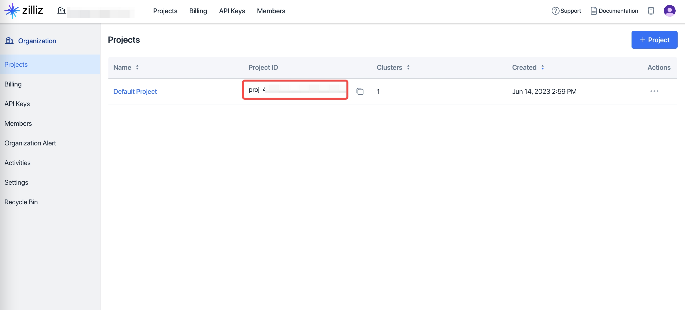
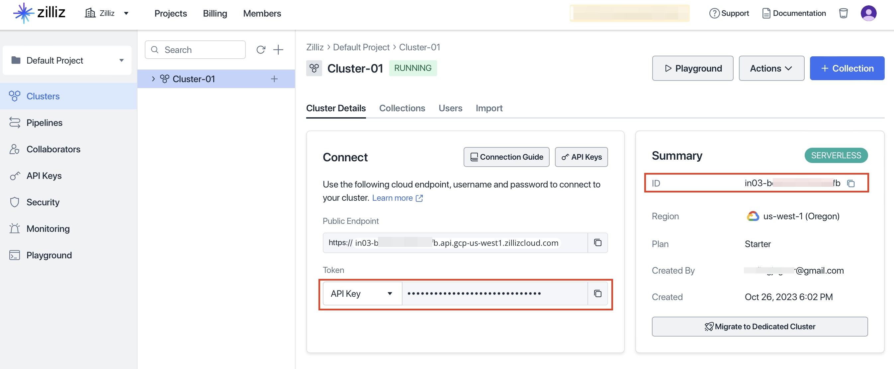

# *SecuriAI* **安鉴无界**
本项目旨在利用检索增强生成（RAG）模型构建安全法律体系智能问答系统，用于实现法律法规、司法案例及原则性法理知识的高效检索、准确匹配与专业性答案生成，并适用于国家安全与个人数据保护等专业场景和普法场景。通过本模型，您可进行私有化部署与定制化法律助手开发，满足政府机构、企业和个人用户差异化需求。
 ## 🥰如何构建您的私人问答助手？ ##
 ### 本项目需要： ###
     获取Qwen API Key 
     安装LlamaIndex
     安装python3
     获取Zilliz Cloud账号
     virtualenv虚拟环境（可选）
### 步骤一 配置Qwen API key ###
项目使用通义千问作为底层大模型，开始搭建前，请在[config.yaml](./cfgs/config.yaml)文件中配置Qwen API key(格式类似于sk-xxxxxxxx)。如果没有，请参考[通义千问](https://help.aliyun.com/zh/model-studio/use-qwen-by-calling-api) 官方文档获取。参考配置如下：

    llm:
      name: "qwen-turbo-2024-09-19"
      temperature: 0.7
      api_key: "sk-xxxxxxxx"
### 步骤二 获取Zilliz Cloud的配置信息 ###
> ​Zilliz Cloud Pipelines 是 Zilliz 提供的一项服务，旨在简化非结构化数据（如文本、文档和图像）的处理流程，将其转换为可搜索的向量集合。该服务直接内置支持主流嵌入模型（如 OpenAI、Cohere、Hugging Face 等），自动完成向量化过程，无需自己部署、调用嵌入模型。与本地部署相比，Zilliz Cloud Pipelines服务提供了更好的伸缩弹性，免去了维护生产环境中复杂组件的麻烦，其召回质量会随着云上功能的迭代持续更新优化，并且支持召回方案的个性化配置。

注册[Zilliz Cloud](https://cloud.zilliz.com/signup?utm_source=partner&utm_medium=referral&utm_campaign=2024-01-18_product_zcp-demos_github&utm_content=history-rag)账号，获取相应project配置。您可以参考[这里](https://github.com/milvus-io/bootcamp/blob/master/bootcamp/RAG/zilliz_pipeline_rag.ipynb)了解更加详细的使用教程。

在系统环境变量中添加：

    export ZILLIZ_PROJECT_ID=<一图中的信息> 
    export ZILLIZ_TOKEN=<二图左边红框的信息> 
    export ZILLIZ_CLUSTER_ID=<二图右边红框的信息>
### 步骤三 安装python依赖 ###
如果您的环境中没有Python3，可以参考[这里](https://www.w3cschool.cn/python3/python3-install.html)安装。（查看您的python路径，请打开cmd输入where Python）

**（可选）** 本项目中使用的python依赖可能会和现有环境产生冲突，如果您担心这一点，可以使用virtualenv工具建立一个新的依赖环境，退出该环境时使用deactivate。请注意使用这种方式会重新下载pytorch等依赖项（即便本机已经安装了它们），可能耗时较长。

    pip install virtualenv
    virtualenv rag
    source rag/bin/activate
现在安装所需依赖：

    pip install -r requirements.txt
### 步骤四 构建法律知识库 ###
执行前端交互程序app.py，该过程中会将文本切片并生成向量，构建向量索引：

    python app.py
    

如果想一次性导入所有法律文件，可以运行https://github.com/akatrainning/Q-A_Chatter/tree/main/data将该目录下所有文件上传进行索引构建。 注意，Zilliz Cloud Pipelines方案目前仅支持文件以URL的形式导入，后续会支持本地文件和文件夹导入。   
### 步骤五 进行问题查询 ###

